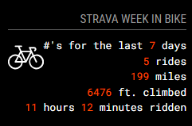

# MMM-StravaWeekInBike

---

A simple magic mirror module for displaying the last 'X' days of riding stats.  


## Table of contents

1. [Setup](#setup)
2. [Configuration](#configuration)
3. [Updates](#updates)

## Setup

-In order to run the module, you'll need to [setup API access](https://developers.strava.com/docs/getting-started/#account) on your Strava account.

-You'll need to get your clientId, clientSecret, and initial refreshToken. Follow [these instructions](https://developers.strava.com/docs/getting-started/#oauth) to get those values.

-Scopes for the token should include: activity:read_all

- Note: The access token and refresh tokens are kept in a file in the directory above the module. This is for the case where you are running both of my Strava MM modules, they'll share the token data between them allowing them to stay in sync and avoid "Unauthorized" errors

### The `strava_access_token.json` file

This module manages its own Strava access token automatically — you do not need to create this file yourself, and you should not edit it by hand.

- **Location:** `MagicMirror/modules/strava_access_token.json`, i.e. one directory *above* this module's folder. Because it lives in the shared `modules/` directory rather than inside `MMM-StravaWeekInBike/`, any other Strava module you install alongside this one (that follows the same convention) can read and write the same file, keeping their tokens in sync.
- **When it's created/updated:**
  - If the file doesn't exist yet, it's created the first time the module requests stats, using the `clientId`, `clientSecret`, and `refreshToken` from your config to exchange for a new access token.
  - If the file exists, its `access_token` is reused as long as it hasn't expired (`expires_at` is in the future).
  - If the token is missing or expired, the module requests a new one from Strava (using the `refresh_token` stored in the file, or your configured `refreshToken` if the file has none) and overwrites the file with the response.
  - If a Strava API call returns a `401 Unauthorized`, the module will also refresh the token and rewrite the file before retrying once.
- **Contents:** the raw JSON response from Strava's `/oauth/token` endpoint, for example:
  ```json
  {
    "token_type": "Bearer",
    "access_token": "a4b945687g...",
    "expires_at": 1568775134,
    "expires_in": 21600,
    "refresh_token": "adfd345..."
  }
  ```
- Because this file contains a live access/refresh token pair, don't commit it to source control or share it.

## Configuration

```js
{
  module: "MMM-StravaWeekInBike",
  position: "top_right",
  config: {
    clientId: "[YOUR CLIENT ID]",
    clientSecret: "[YOUR CLIENT SECRET]",
    refreshToken: "[YOUR REFRESH TOKEN]",
    numberOfDaysToQuery: 7, //number of days to look back for stats
    maxWidth: "250px",
    header: "Strava Week in Bike" //custom header if you want something different
  }
}
```

## Updates

I will likely continue to update the module. When you see that an update is available:

1. Open the command prompt and change to directory \MagicMirror\modules\MMM-StravaWeekInBike\
2. Run command `git pull`
3. Restart the Magic Mirror
